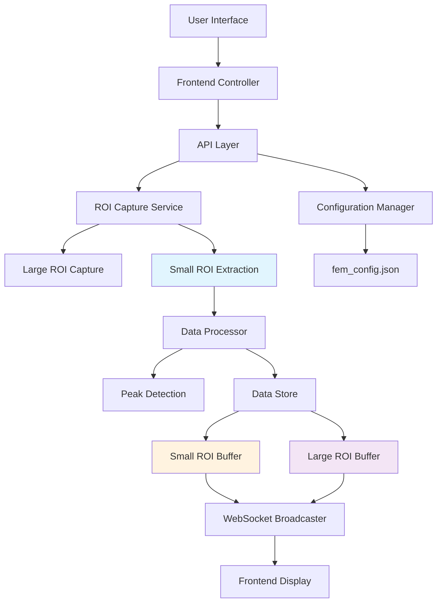
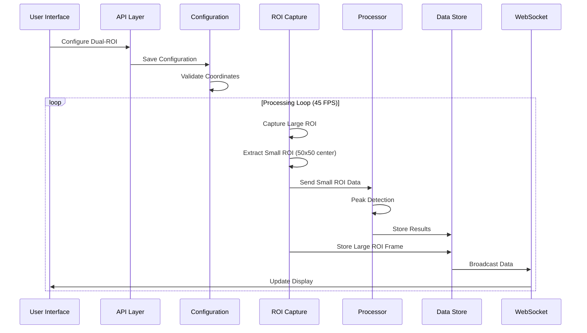

# dual-roi-system - Task 6.1

Execute task 6.1 for the dual-roi-system specification.

## Task Description
Update data processor for dual-ROI in backend/app/core/processor.py

## Code Reuse
**Leverage existing code**: existing DataProcessor class, processing pipeline

## Requirements Reference
**Requirements**: 3.1, 3.2

## Usage
```
/Task:6.1-dual-roi-system
```

## Instructions

Execute with @spec-task-executor agent the following task: "Update data processor for dual-ROI in backend/app/core/processor.py"

```
Use the @spec-task-executor agent to implement task 6.1: "Update data processor for dual-ROI in backend/app/core/processor.py" for the dual-roi-system specification and include all the below context.

# Steering Context
## Steering Documents Context

No steering documents found or all are empty.

# Specification Context
## Specification Context (Pre-loaded): dual-roi-system

### Requirements
# Requirements Document

## Introduction

This document outlines the requirements for implementing a dual-ROI (Region of Interest) system in the NHEM (New HEM Monitor) project. The dual-ROI system will introduce a large configurable ROI region alongside a fixed 50x50 small ROI region that is automatically extracted from the center of the large ROI. This enhancement will provide users with more flexible data analysis capabilities while maintaining backward compatibility with the existing single-ROI functionality.

The dual-ROI system addresses the need for broader context awareness (through the large ROI) while maintaining precise analysis capabilities (through the small ROI). The large ROI will be used for visual context and display, while the small ROI will continue to serve as the primary source for data analysis and peak detection, ensuring consistency with existing analytical algorithms.

## Alignment with Product Vision

This feature supports the NHEM project's goal of providing a comprehensive real-time signal processing system for HEM detection and monitoring. The dual-ROI system enhances the system's analytical capabilities by:

1. **Improved Context Awareness**: Users can visualize a larger region while maintaining precise analysis
2. **Enhanced Flexibility**: Configurable large ROI allows adaptation to different monitoring scenarios
3. **Backward Compatibility**: Existing workflows and configurations remain functional
4. **Performance Optimization**: Efficient resource utilization through shared processing pipelines

## Requirements

### Requirement 1: Dual-ROI Configuration Management

**User Story:** As a system administrator, I want to configure both large and small ROI regions, so that I can optimize the monitoring area for different scenarios.

#### Acceptance Criteria

1. WHEN the system starts THEN it SHALL support both dual-ROI mode and legacy single-ROI mode
2. WHEN in dual-ROI mode THEN the system SHALL store configuration for both large ROI (configurable) and small ROI (fixed 50x50)
3. WHEN setting large ROI configuration THEN the system SHALL validate coordinates are within screen bounds
4. WHEN large ROI is configured THEN the system SHALL automatically calculate small ROI coordinates as the center 50x50 region
5. IF no large ROI is configured THEN the system SHALL operate in legacy single-ROI mode
6. WHEN configuration is saved THEN it SHALL persist across system restarts

### Requirement 2: Large ROI Display and Visualization

**User Story:** As a monitoring operator, I want to see the large ROI region in real-time, so that I can maintain visual context of the monitoring area.

#### Acceptance Criteria

1. WHEN in dual-ROI mode THEN the frontend SHALL display the large ROI image (Read from fem_config.json)
2. WHEN large ROI is updated THEN the display SHALL refresh at the independently configured frame rate (default 5 FPS, separate from 45 FPS main processing)
3. IF large ROI capture fails THEN the system SHALL gracefully fallback to the last successful capture
4. WHEN displaying large ROI THEN the interface SHALL overlay visual indicators showing the small ROI extraction area
5. WHEN screen resolution changes THEN the system SHALL automatically adjust ROI coordinates to remain within bounds

### Requirement 3: Small ROI Data Processing and Analysis

**User Story:** As a data analyst, I want the system to use the small ROI for all data analysis and peak detection, so that analytical consistency is maintained.

#### Acceptance Criteria

1. WHEN processing data THEN the system SHALL extract the 50x50 small ROI from the center of the large ROI
2. WHEN performing peak detection THEN the system SHALL use data from the small ROI only
3. WHEN generating time-series data THEN the system SHALL calculate gray values from the small ROI
4. IF large ROI is smaller than 50x50 THEN the system SHALL use the entire large ROI for analysis
5. WHEN storing historical data THEN the system SHALL save small ROI data to existing buffers
6. WHEN small ROI extraction fails THEN the system SHALL log the error and continue with last successful data

### Requirement 4: API Extension and Backward Compatibility

**User Story:** As a developer, I want extended API endpoints that support dual-ROI while maintaining compatibility with existing clients, so that integration remains seamless.

#### Acceptance Criteria

1. WHEN existing clients call ROI endpoints THEN the system SHALL continue to work with single-ROI configuration
2. WHEN new clients request dual-ROI data THEN the system SHALL return both large and small ROI information
3. WHEN configuring ROI via API THEN the system SHALL accept both legacy (single) and new dual-ROI formats
4. IF API request specifies dual-ROI mode THEN the system SHALL validate large ROI coordinates before saving
5. WHEN querying ROI status THEN the system SHALL indicate current mode (single vs dual) and relevant configurations
6. WHEN deprecated endpoints are called THEN the system SHALL provide appropriate responses without breaking functionality

### Requirement 5: Frontend UI Enhancement

**User Story:** As a monitoring operator, I want an enhanced interface that shows both ROI regions and relevant controls, so that I can effectively manage the dual-ROI system.

#### Acceptance Criteria

1. WHEN in dual-ROI mode THEN the interface SHALL display both large ROI visualization and small ROI data charts
2. WHEN configuring ROI THEN users SHALL be able to set large ROI coordinates through input fields
3. WHEN switching modes THEN the interface SHALL adapt seamlessly between single and dual-ROI layouts
4. WHEN displaying ROI data THEN the system SHALL show clear visual indicators for mode and configuration status
5. IF large ROI is not configured THEN the interface SHALL display appropriate setup instructions
6. WHEN adjusting ROI settings THEN real-time preview SHALL be available before applying changes

## Non-Functional Requirements

### Performance
- Dual-ROI processing SHALL NOT increase overall system memory usage by more than 20%
- Large ROI capture frame rate SHALL be independently configurable from main processing FPS
- Small ROI extraction SHALL complete within 5ms per frame to maintain real-time performance
- API response times SHALL remain under 50ms for dual-ROI endpoints

### Security
- ROI coordinate validation SHALL prevent out-of-bounds screen access
- Configuration changes SHALL require appropriate authentication (existing password system)
- Input validation SHALL follow existing Pydantic model patterns
- Error messages SHALL not expose sensitive system information

### Reliability
- Small ROI extraction SHALL have 99.9% success rate when large ROI is properly configured
- System SHALL gracefully fallback to legacy mode if dual-ROI processing fails
- Configuration persistence SHALL survive system restarts and crashes
- Memory management SHALL prevent leaks in ROI image buffers

### Usability
- Mode switching SHALL be intuitive and clearly indicated in the UI
- Configuration interface SHALL provide real-time validation feedback
- Visual indicators SHALL clearly distinguish between large and small ROI displays
- System SHALL provide helpful error messages and setup guidance

### Compatibility
- Existing single-ROI configurations SHALL continue to work without modification
- API versioning SHALL maintain backward compatibility for legacy clients
- Python client SHALL support both ROI modes without breaking changes
- Configuration schema changes SHALL be additive and non-destructive
- Historical data SHALL remain accessible after mode switching
- WebSocket message formats SHALL maintain compatibility with existing clients

### Migration and Transition
- System SHALL provide seamless upgrade path from single to dual-ROI configurations
- Configuration validation SHALL prevent data corruption during mode transitions
- Existing ROI settings SHALL be automatically converted to dual-ROI format when appropriate
- Users SHALL be able to revert from dual-ROI to single-ROI mode without data loss

---

### Design
# Design Document

## Overview

This document outlines the technical design for implementing a dual-ROI (Region of Interest) system in the NHEM project. The dual-ROI system introduces a large configurable ROI region alongside a fixed 50x50 small ROI region extracted from the center of the large ROI. This design maintains backward compatibility with existing single-ROI functionality while providing enhanced analytical capabilities.

The system will operate in two modes: legacy single-ROI mode for existing deployments and dual-ROI mode for enhanced monitoring. The large ROI provides visual context and broader monitoring area, while the small ROI maintains the existing analytical precision for peak detection and data analysis.

## Steering Document Alignment

### Technical Standards (tech.md)
- **FastAPI Architecture**: Extends existing FastAPI patterns with Pydantic models for validation
- **Threading Model**: Maintains thread-safe data structures using existing lock patterns
- **Configuration System**: Leverages multi-layer configuration (JSON → Environment → Defaults)
- **Memory Management**: Uses circular buffers with configurable sizes for memory efficiency
- **Error Handling**: Follows existing error response patterns and logging conventions

### Project Structure (structure.md)
- **Backend Extensions**: Extends existing `app/core/` modules with dual-ROI support
- **API Layer**: Enhances existing `app/api/routes.py` with backward-compatible endpoints
- **Frontend Integration**: Extends existing `index.html` single-page application
- **Configuration**: Extends existing `fem_config.json` with dual-ROI settings

## Code Reuse Analysis

### Existing Components to Leverage
- **RoiConfig Class**: Extended to support dual ROI configurations with backward compatibility
- **RoiCaptureService**: Modified to support simultaneous large and small ROI capture
- **DataStore**: Enhanced with separate buffers for large ROI while maintaining small ROI compatibility
- **Processor**: Updated to extract small ROI from large ROI center for analysis
- **WebSocket Broadcasting**: Enhanced to include large ROI data in existing message structure
- **Frontend Canvas Rendering**: Extended to display both ROI regions using existing rendering pipeline

### Integration Points
- **Configuration Manager**: Integrates dual-ROI settings into existing configuration hierarchy
- **API Endpoints**: Extends existing `/roi/*` endpoints with dual-ROI support
- **Real-time Data Pipeline**: Integrates large ROI capture into existing 45 FPS processing loop
- **Peak Detection**: Continues using existing algorithms with small ROI data
- **Python Client**: Enhanced configuration UI and display components

## Architecture

The dual-ROI system follows a layered architecture that extends the existing NHEM system without breaking changes:



### Data Flow Architecture



## Components and Interfaces

### Component 1: Dual-ROI Configuration Manager

- **Purpose:** Manages configuration for both ROI modes with validation and migration
- **Interfaces:**
  - `get_dual_roi_config()` → `DualRoiConfig`
  - `set_dual_roi_config(config: DualRoiConfig)` → `bool`
  - `validate_roi_coordinates(roi: RoiConfig)` → `ValidationResult`
  - `migrate_single_to_dual()` → `MigrationResult`
- **Dependencies:** Existing `ConfigManager`, validation utilities
- **Reuses:** Existing coordinate validation, configuration persistence, environment variable handling

### Component 2: Enhanced ROI Capture Service

- **Purpose:** Captures large ROI and extracts small ROI with independent frame rates
- **Interfaces:**
  - `capture_dual_roi()` → `DualRoiFrame`
  - `extract_small_roi(large_frame: Image, center_x: int, center_y: int)` → `Image`
  - `set_large_roi_frame_rate(fps: int)` → `bool`
- **Dependencies:** PIL/Pillow, screen capture utilities, coordinate validation
- **Reuses:** Existing `RoiCaptureService`, image processing pipeline, Base64 encoding

### Component 3: Dual-ROI Data Store

- **Purpose:** Manages separate buffers for large and small ROI data with thread safety
- **Interfaces:**
  - `store_dual_roi_data(frame: DualRoiFrame)` → `void`
  - `get_large_roi_history(count: int)` → `List[RoiFrame]`
  - `get_small_roi_history(count: int)` → `List[RoiFrame]`
- **Dependencies:** Thread locks, circular buffer implementations
- **Reuses:** Existing `DataStore` architecture, buffer management, frame counting

### Component 4: Extended API Endpoints

- **Purpose:** Provides backward-compatible API endpoints for dual-ROI operations
- **Interfaces:**
  - `GET /roi/config` → `RoiConfigResponse` (legacy mode)
  - `GET /roi/config?mode=dual` → `DualRoiConfigResponse`
  - `POST /roi/config` → `ConfigResponse` (auto-detect mode)
  - `GET /roi/dual-frame` → `DualRoiFrameResponse`
- **Dependencies:** FastAPI, Pydantic models, existing authentication
- **Reuses:** Existing endpoint patterns, error handling, response formatting

### Component 5: Enhanced Frontend Display

- **Purpose:** Renders both ROI regions with visual indicators and controls
- **Interfaces:**
  - `render_dual_roi_display(large_roi: Image, small_roi: Image)` → `void`
  - `update_roi_controls(config: DualRoiConfig)` → `void`
  - `show_mode_indicator(mode: 'single' | 'dual')` → `void`
- **Dependencies:** HTML5 Canvas, JavaScript event handlers
- **Reuses:** Existing canvas rendering, CSS themes, HTTP polling logic

## Data Models

### DualRoiConfig
```python
class DualRoiConfig(BaseModel):
    mode: str  # 'single' | 'dual'
    large_roi: Optional[RoiConfig] = None  # Configurable (default 300x200)
    small_roi_size: Tuple[int, int] = (50, 50)  # Fixed size
    large_roi_frame_rate: int = 5  # Independent from main processing FPS

    # Backward compatibility
    legacy_roi: Optional[RoiConfig] = None  # For single-ROI mode
```

### RoiConfig (Enhanced)
```python
class RoiConfig(BaseModel):
    x1: int
    y1: int
    x2: int
    y2: int
    frame_rate: Optional[int] = None  # For backward compatibility

    # Validation
    @validator('x2', 'y2')
    def validate_coordinates(cls, v, values):
        # Enhanced validation for screen bounds and minimum size
        pass
```

### DualRoiFrame
```python
class DualRoiFrame(BaseModel):
    timestamp: float
    large_roi: RoiData  # 300x200 or configured size
    small_roi: RoiData  # 50x50 extracted from center
    processing_metadata: Dict[str, Any]
```

### API Response Models
```python
class RoiConfigResponse(BaseModel):
    mode: str
    config: Union[RoiConfig, DualRoiConfig]
    status: str
    message: Optional[str] = None

class DualRoiFrameResponse(BaseModel):
    large_roi_image: str  # Base64 encoded
    small_roi_image: str  # Base64 encoded
    small_roi_gray_value: float
    timestamp: float
    mode: str
```

## Configuration Schema

### Enhanced fem_config.json Structure
```json
{
  "roi_capture": {
    "mode": "dual",  // "single" | "dual"
    "large_roi": {
      "x1": 1480,
      "y1": 480,
      "x2": 1780,  // 300px width
      "y2": 680,  // 200px height
      "frame_rate": 5
    },
    "small_roi": {
      "size": [50, 50],  // Fixed size
      "extraction": "center"  // Always center of large ROI
    },
    "legacy_roi": {  // Backward compatibility
      "x1": 10,
      "y1": 20,
      "x2": 210,
      "y2": 170
    }
  }
}
```

## Error Handling

### Error Scenarios

1. **Invalid ROI Coordinates**
   - **Handling:** Automatic adjustment to screen bounds with warning
   - **User Impact:** ROI config saved with adjusted coordinates, notification shown

2. **Large ROI Smaller Than Small ROI**
   - **Handling:** Use entire large ROI as small ROI, log warning
   - **User Impact:** System continues in dual mode with degraded precision

3. **Screen Resolution Changes**
   - **Handling:** Auto-adjust coordinates, validate bounds, save updated config
   - **User Impact:** ROI positions automatically updated, notification sent

4. **Capture Service Failure**
   - **Handling:** Fallback to last successful frame, retry with exponential backoff
   - **User Impact:** Display shows last known good frame with retry indicator

5. **Configuration Migration Failure**
   - **Handling:** Preserve original config, create migration report, offer manual conversion
   - **User Impact:** System remains in single-ROI mode with migration options

## Testing Strategy

### Unit Testing
- Test ROI coordinate validation and boundary adjustment
- Test small ROI extraction from various large ROI sizes
- Test configuration migration scenarios
- Test data store thread safety and buffer management

### Integration Testing
- Test API endpoint backward compatibility
- Test configuration persistence across service restarts
- Test WebSocket message format changes
- Test frontend-backend data synchronization

### End-to-End Testing
- Test complete dual-ROI workflow from configuration to display
- Test mode switching between single and dual ROI
- Test performance under high frame rates
- Test error recovery and fallback scenarios

## Performance Considerations

### Memory Usage
- Large ROI buffer: ~100KB per frame (300x200 RGB)
- Small ROI buffer: ~7.5KB per frame (50x50 RGB)
- Additional memory overhead: ~15-20% increase in total usage

### Processing Impact
- Small ROI extraction: ~1-2ms per frame
- Large ROI capture: ~3-5ms per frame (independent thread)
- Overall system impact: <5% performance degradation

### Optimization Strategies
- Lazy loading of large ROI display components
- Efficient center extraction using array slicing
- Frame caching for failed capture scenarios
- Configurable buffer sizes for memory tuning

**Note**: Specification documents have been pre-loaded. Do not use get-content to fetch them again.

## Task Details
- Task ID: 6.1
- Description: Update data processor for dual-ROI in backend/app/core/processor.py
- Leverage: existing DataProcessor class, processing pipeline
- Requirements: 3.1, 3.2

## Instructions
- Implement ONLY task 6.1: "Update data processor for dual-ROI in backend/app/core/processor.py"
- Follow all project conventions and leverage existing code
- Mark the task as complete using: claude-code-spec-workflow get-tasks dual-roi-system 6.1 --mode complete
- Provide a completion summary
```

## Task Completion
When the task is complete, mark it as done:
```bash
claude-code-spec-workflow get-tasks dual-roi-system 6.1 --mode complete
```

## Next Steps
After task completion, you can:
- Execute the next task using /dual-roi-system-task-[next-id]
- Check overall progress with /spec-status dual-roi-system
