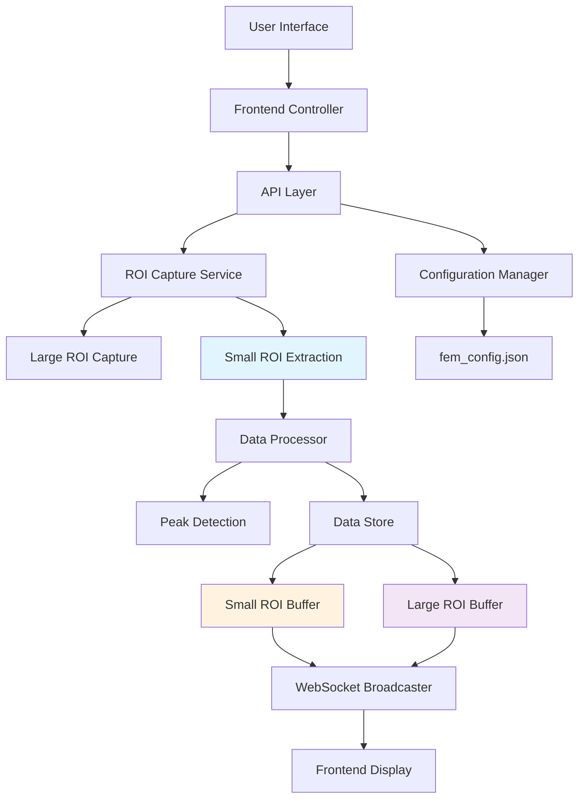
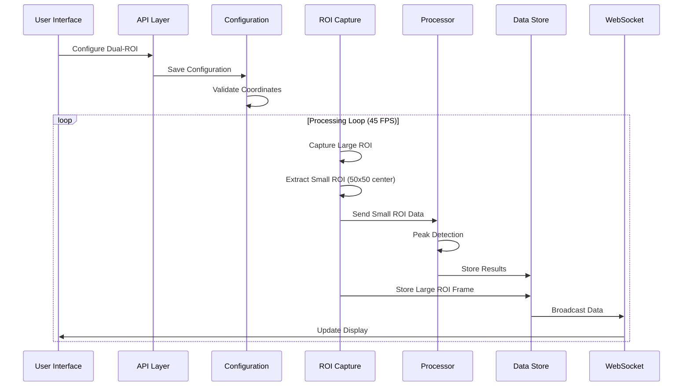

# Design Document

## Overview

This document outlines the technical design for implementing a dual-ROI (Region of Interest) system in the NHEM project. The dual-ROI system introduces a large configurable ROI region alongside a fixed 50x50 small ROI region extracted from the center of the large ROI. This design maintains backward compatibility with existing single-ROI functionality while providing enhanced analytical capabilities.

The system will operate in two modes: legacy single-ROI mode for existing deployments and dual-ROI mode for enhanced monitoring. The large ROI provides visual context and broader monitoring area, while the small ROI maintains the existing analytical precision for peak detection and data analysis.

## Steering Document Alignment

### Technical Standards (tech.md)
- **FastAPI Architecture**: Extends existing FastAPI patterns with Pydantic models for validation
- **Threading Model**: Maintains thread-safe data structures using existing lock patterns
- **Configuration System**: Leverages multi-layer configuration (JSON → Environment → Defaults)
- **Memory Management**: Uses circular buffers with configurable sizes for memory efficiency
- **Error Handling**: Follows existing error response patterns and logging conventions

### Project Structure (structure.md)
- **Backend Extensions**: Extends existing `app/core/` modules with dual-ROI support
- **API Layer**: Enhances existing `app/api/routes.py` with backward-compatible endpoints
- **Frontend Integration**: Extends existing `index.html` single-page application
- **Configuration**: Extends existing `fem_config.json` with dual-ROI settings

## Code Reuse Analysis

### Existing Components to Leverage
- **RoiConfig Class**: Extended to support dual ROI configurations with backward compatibility
- **RoiCaptureService**: Modified to support simultaneous large and small ROI capture
- **DataStore**: Enhanced with separate buffers for large ROI while maintaining small ROI compatibility
- **Processor**: Updated to extract small ROI from large ROI center for analysis
- **WebSocket Broadcasting**: Enhanced to include large ROI data in existing message structure
- **Frontend Canvas Rendering**: Extended to display both ROI regions using existing rendering pipeline

### Integration Points
- **Configuration Manager**: Integrates dual-ROI settings into existing configuration hierarchy
- **API Endpoints**: Extends existing `/roi/*` endpoints with dual-ROI support
- **Real-time Data Pipeline**: Integrates large ROI capture into existing 45 FPS processing loop
- **Peak Detection**: Continues using existing algorithms with small ROI data
- **Python Client**: Enhanced configuration UI and display components

## Architecture

The dual-ROI system follows a layered architecture that extends the existing NHEM system without breaking changes:



### Data Flow Architecture



## Components and Interfaces

### Component 1: Dual-ROI Configuration Manager

- **Purpose:** Manages configuration for both ROI modes with validation and migration
- **Interfaces:**
  - `get_dual_roi_config()` → `DualRoiConfig`
  - `set_dual_roi_config(config: DualRoiConfig)` → `bool`
  - `validate_roi_coordinates(roi: RoiConfig)` → `ValidationResult`
  - `migrate_single_to_dual()` → `MigrationResult`
- **Dependencies:** Existing `ConfigManager`, validation utilities
- **Reuses:** Existing coordinate validation, configuration persistence, environment variable handling

### Component 2: Enhanced ROI Capture Service

- **Purpose:** Captures large ROI and extracts small ROI with independent frame rates
- **Interfaces:**
  - `capture_dual_roi()` → `DualRoiFrame`
  - `extract_small_roi(large_frame: Image, center_x: int, center_y: int)` → `Image`
  - `set_large_roi_frame_rate(fps: int)` → `bool`
- **Dependencies:** PIL/Pillow, screen capture utilities, coordinate validation
- **Reuses:** Existing `RoiCaptureService`, image processing pipeline, Base64 encoding

### Component 3: Dual-ROI Data Store

- **Purpose:** Manages separate buffers for large and small ROI data with thread safety
- **Interfaces:**
  - `store_dual_roi_data(frame: DualRoiFrame)` → `void`
  - `get_large_roi_history(count: int)` → `List[RoiFrame]`
  - `get_small_roi_history(count: int)` → `List[RoiFrame]`
- **Dependencies:** Thread locks, circular buffer implementations
- **Reuses:** Existing `DataStore` architecture, buffer management, frame counting

### Component 4: Extended API Endpoints

- **Purpose:** Provides backward-compatible API endpoints for dual-ROI operations
- **Interfaces:**
  - `GET /roi/config` → `RoiConfigResponse` (legacy mode)
  - `GET /roi/config?mode=dual` → `DualRoiConfigResponse`
  - `POST /roi/config` → `ConfigResponse` (auto-detect mode)
  - `GET /roi/dual-frame` → `DualRoiFrameResponse`
- **Dependencies:** FastAPI, Pydantic models, existing authentication
- **Reuses:** Existing endpoint patterns, error handling, response formatting

### Component 5: Enhanced Frontend Display

- **Purpose:** Renders both ROI regions with visual indicators and controls
- **Interfaces:**
  - `render_dual_roi_display(large_roi: Image, small_roi: Image)` → `void`
  - `update_roi_controls(config: DualRoiConfig)` → `void`
  - `show_mode_indicator(mode: 'single' | 'dual')` → `void`
- **Dependencies:** HTML5 Canvas, JavaScript event handlers
- **Reuses:** Existing canvas rendering, CSS themes, HTTP polling logic

## Data Models

### DualRoiConfig
```python
class DualRoiConfig(BaseModel):
    mode: str  # 'single' | 'dual'
    large_roi: Optional[RoiConfig] = None  # Configurable (default 300x200)
    small_roi_size: Tuple[int, int] = (50, 50)  # Fixed size
    large_roi_frame_rate: int = 5  # Independent from main processing FPS

    # Backward compatibility
    legacy_roi: Optional[RoiConfig] = None  # For single-ROI mode
```

### RoiConfig (Enhanced)
```python
class RoiConfig(BaseModel):
    x1: int
    y1: int
    x2: int
    y2: int
    frame_rate: Optional[int] = None  # For backward compatibility

    # Validation
    @validator('x2', 'y2')
    def validate_coordinates(cls, v, values):
        # Enhanced validation for screen bounds and minimum size
        pass
```

### DualRoiFrame
```python
class DualRoiFrame(BaseModel):
    timestamp: float
    large_roi: RoiData  # 300x200 or configured size
    small_roi: RoiData  # 50x50 extracted from center
    processing_metadata: Dict[str, Any]
```

### API Response Models
```python
class RoiConfigResponse(BaseModel):
    mode: str
    config: Union[RoiConfig, DualRoiConfig]
    status: str
    message: Optional[str] = None

class DualRoiFrameResponse(BaseModel):
    large_roi_image: str  # Base64 encoded
    small_roi_image: str  # Base64 encoded
    small_roi_gray_value: float
    timestamp: float
    mode: str
```

## Configuration Schema

### Enhanced fem_config.json Structure
```json
{
  "roi_capture": {
    "mode": "dual",  // "single" | "dual"
    "large_roi": {
      "x1": 1480,
      "y1": 480,
      "x2": 1780,  // 300px width
      "y2": 680,  // 200px height
      "frame_rate": 5
    },
    "small_roi": {
      "size": [50, 50],  // Fixed size
      "extraction": "center"  // Always center of large ROI
    },
    "legacy_roi": {  // Backward compatibility
      "x1": 10,
      "y1": 20,
      "x2": 210,
      "y2": 170
    }
  }
}
```

## Error Handling

### Error Scenarios

1. **Invalid ROI Coordinates**
   - **Handling:** Automatic adjustment to screen bounds with warning
   - **User Impact:** ROI config saved with adjusted coordinates, notification shown

2. **Large ROI Smaller Than Small ROI**
   - **Handling:** Use entire large ROI as small ROI, log warning
   - **User Impact:** System continues in dual mode with degraded precision

3. **Screen Resolution Changes**
   - **Handling:** Auto-adjust coordinates, validate bounds, save updated config
   - **User Impact:** ROI positions automatically updated, notification sent

4. **Capture Service Failure**
   - **Handling:** Fallback to last successful frame, retry with exponential backoff
   - **User Impact:** Display shows last known good frame with retry indicator

5. **Configuration Migration Failure**
   - **Handling:** Preserve original config, create migration report, offer manual conversion
   - **User Impact:** System remains in single-ROI mode with migration options

## Testing Strategy

### Unit Testing
- Test ROI coordinate validation and boundary adjustment
- Test small ROI extraction from various large ROI sizes
- Test configuration migration scenarios
- Test data store thread safety and buffer management

### Integration Testing
- Test API endpoint backward compatibility
- Test configuration persistence across service restarts
- Test WebSocket message format changes
- Test frontend-backend data synchronization

### End-to-End Testing
- Test complete dual-ROI workflow from configuration to display
- Test mode switching between single and dual ROI
- Test performance under high frame rates
- Test error recovery and fallback scenarios

## Performance Considerations

### Memory Usage
- Large ROI buffer: ~100KB per frame (300x200 RGB)
- Small ROI buffer: ~7.5KB per frame (50x50 RGB)
- Additional memory overhead: ~15-20% increase in total usage

### Processing Impact
- Small ROI extraction: ~1-2ms per frame
- Large ROI capture: ~3-5ms per frame (independent thread)
- Overall system impact: <5% performance degradation

### Optimization Strategies
- Lazy loading of large ROI display components
- Efficient center extraction using array slicing
- Frame caching for failed capture scenarios
- Configurable buffer sizes for memory tuning